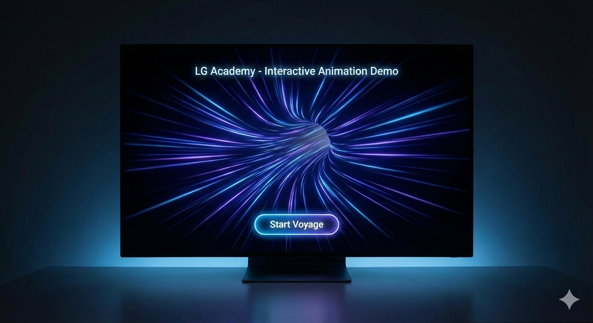
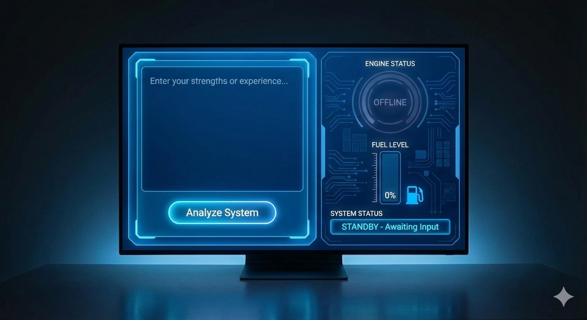
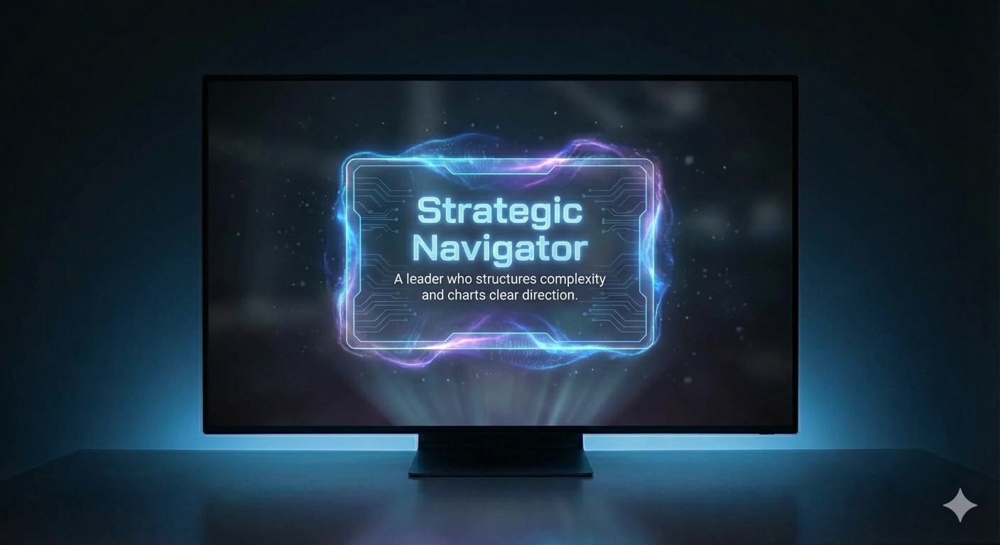

# PRD - Interactive Animation Demo (Space Voyage Concept)

## 1. Project Objective

This demo is designed to present the core interactive experience of the proposed micro-site for **LG Academy**.

The purpose is not to demonstrate full system functionality, but to validate the **immersive storytelling and visual transformation** concept.

### Key Goals

- Deliver a cinematic opening experience
- Demonstrate real-time transformation of user input into visual elements
- Create an emotionally engaging result reveal sequence

---

## 2. Feature Scope (3-Screen Demo)

---

### Screen 1 - Warp Entry

#### Objective

To establish that this is not a conventional survey tool, but an immersive narrative experience.

#### UI Composition

- Fullscreen dark background
- Centered Lottie warp-speed animation
- Bottom CTA button: **"Start Voyage"**

#### Interaction Flow

- User clicks "Start Voyage"
- Warp animation accelerates (scale + motion blur effect)
- After 0.6 seconds, smooth transition to cockpit interface

#### Technologies Used

- **Lottie** - `warp.json` animation file
- **Framer Motion** - opacity + scale transitions
- **CSS** - blur and glow effects

---

### Screen 2 - Input / Visual Transformation

#### Objective

To demonstrate how user input dynamically transforms into visual system elements.

#### UI Layout

- **Left panel:** Text input area
- **Right panel:** Spaceship status dashboard
  - Engine indicator
  - Fuel gauge
  - System status label

#### Interaction Flow

1. User enters text (e.g., strengths or experience)
2. User clicks **"Analyze System"**
3. 1-second loading animation plays
4. Visual transformation occurs

#### Visual Transformations

- Engine glow activates (CSS shadow effect)
- Fuel gauge animates from 0% to 75%
- UI theme color transitions from blue to purple

#### Technical Implementation

- **Framer Motion** - animated width progression
- **CSS transitions** - dynamic theme color change
- **Lottie** - engine ignition animation

---

### Screen 3 - Identity Reveal

#### Objective

To create an emotionally impactful identity generation moment.

#### UI Composition

- Darkened overlay background
- Center holographic identity card

#### Animation Sequence

1. Background dims
2. Subtle particle fade-in effect
3. Text appears with typewriter animation

#### Example Output

> **Strategic Navigator**
> A leader who structures complexity and charts clear direction.

#### Technologies Used

- **Framer Motion** - fade + upward motion
- **Typewriter effect** - JavaScript-based
- **CSS** - glow and backdrop blur for hologram styling
